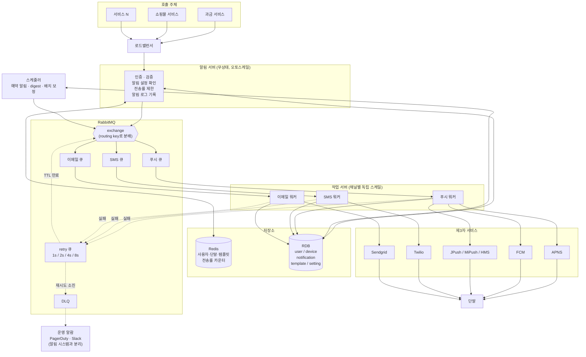
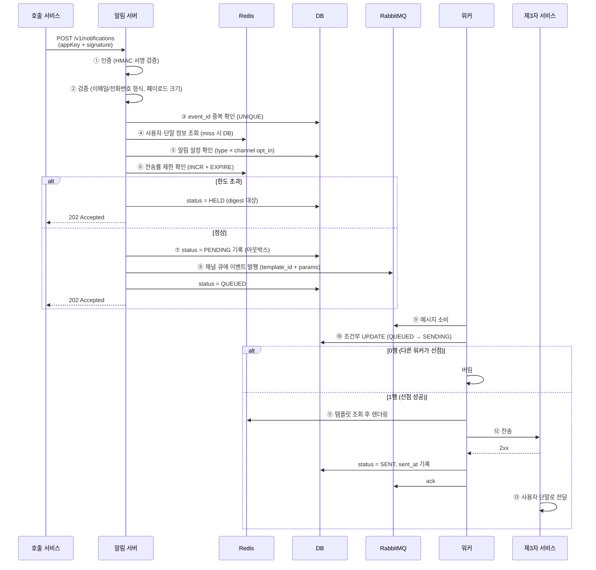
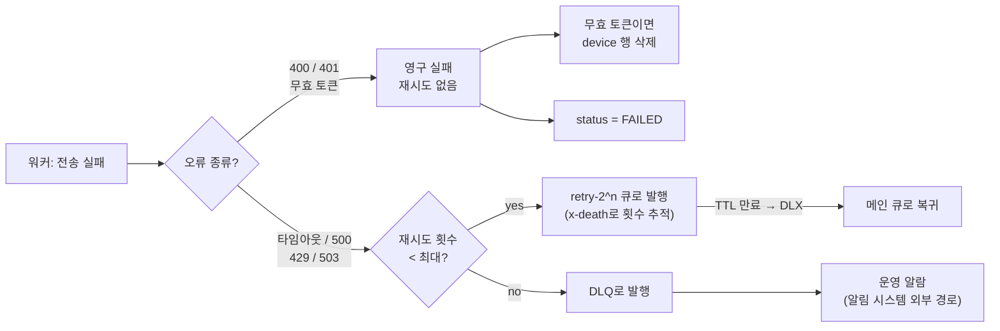
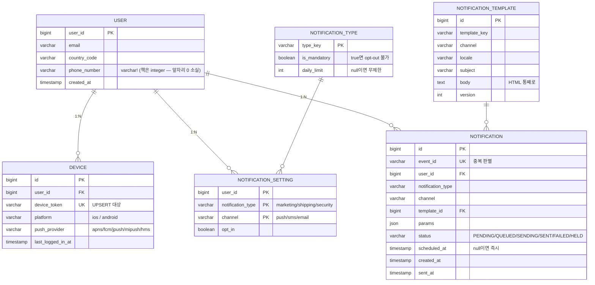
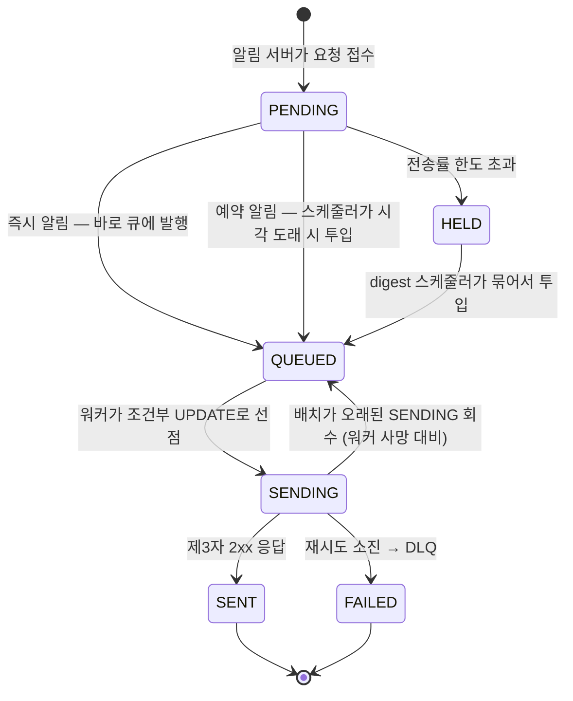

# Ch.10 알림 시스템 설계 — 발표 & 설계

## 스터디에서 공유하고 싶은 포인트

책이 짧게 넘어갔거나, 학습하며 오해를 바로잡은 지점들.

### 1. 메시지 큐를 "쓴다"까지만 말하는 책 — 그래서 무엇을 쓸 것인가

책은 "메시지 큐를 이용해 결합을 끊는다"고만 하고 **어떤 큐인지는 말하지 않는다.** 그런데 큐 종류에 따라 재시도·중복 방지·유실 방지 설계가 통째로 달라진다.

**흔한 오해 정정**: "유실되면 안 되니까 로그형(Kafka)을 써야 한다"는 성립하지 않는다. 브로커형(RabbitMQ/SQS)도 **ack 기반이라 at-least-once를 보장**한다.

```
브로커형은 "소비하면 사라진다" (X)
브로커형은 "ack를 받으면 사라진다" (O)
  → 워커가 처리하다 죽으면 ack가 없으므로 메시지가 큐로 복귀
```

로그형의 진짜 차별점은 유실 방지가 아니라 **이미 성공한 것까지 되감아 재생**할 수 있다는 것.

**SNS를 쓰면 작업 서버가 통째로 사라진다** — APNS 인증, FCM 연동, Twilio SDK를 전부 SNS가 흡수한다. 그럼에도 쓰지 않는 이유는 **전송 계층 통제권** 때문이다(→ 포인트 6).

### 2. 큐가 ack로 유실을 막는데, 왜 DB에 또 저장하나

역할이 겹치는 게 아니라 다르다.

| | 큐의 ack (1차 방어선) | 알림 로그 DB (2차 방어선) |
|---|---|---|
| 막는 것 | 전송 실패 | 조회·감사·중복 판별·복구 |
| 못 하는 것 | 이력 조회, 사용자 문의 대응, 중복 판별 | — |

**"Kafka를 쓰면 로그 DB가 필요 없지 않나?"** → 아니다. Kafka는 브로커 로컬 디스크에 append-only 파일로 저장하므로 `WHERE user_id = 123` 같은 **조건 조회가 불가능**하고, **상태 갱신도 불가능**하며, retention이 지나면 사라진다.

> **Kafka는 흘려보내는 파이프(스트림)이지, 찾아보는 저장소가 아니다.**

### 3. Exactly-Once는 원천적으로 불가능하다

at-least-once와 at-most-once는 **유실이냐 중복이냐**의 양자택일이다. 알림은 유실 불가가 절대 조건이므로 **중복은 설계상 필연적 부작용**이 된다.

```
워커가 APNS에 요청 → 응답이 없음

상황 A: 요청이 도달 안 함        → 재시도해야 함 (안 하면 유실)
상황 B: 처리됐는데 응답만 유실됨  → 재시도하면 안 됨 (하면 중복)

워커가 보는 것: 둘 다 "응답 없음" — 구분 불가능  (두 장군 문제)
```

**"Kafka는 exactly-once 지원한다던데?"** → Kafka **내부**(consume→process→produce)에서만 성립한다. 외부 API로 나가는 순간 보장이 깨진다.

그래서 목표는 제거가 아니라 **빈도 감소**이며, 세 겹으로 방어한다(→ 설계 결정 표 참고). 그럼에도 마지막 구멍(전송 성공 후 기록 실패)은 못 막는다는 것을 인정하는 게 정확한 답이다.

### 4. 큐에는 "결과물"이 아니라 "재료"를 넣는다

템플릿 렌더링을 알림 서버에서 할지 워커에서 할지 — 렌더링 작업량은 어디서 하든 같지만, **큐를 통과하는 데이터가 150배 차이 난다.**

```json
// 알림 서버 렌더링 → 큐에 완성본 (약 30KB)
{ "subject": "...", "body": "<html>...전체 HTML 이메일...</html>" }

// 워커 렌더링 → 큐에 재료만 (약 200B)
{ "template_id": 42, "params": { "item_name": "에어팟", "date": "2026-08-20" } }
```

```
이메일 500만 건/일 기준
  알림 서버 렌더링: 150GB 가 큐를 통과
  워커 렌더링:        1GB 가 큐를 통과
```

게다가 **템플릿 문구를 고쳤을 때** 큐에 밀려 있던 알림에도 반영되려면 워커에서 렌더링해야 한다.

> **큐는 저장소가 아니라 통로다.** 이 원칙은 예약 알림(큐에 미리 넣지 않고 DB에 보류)에도 그대로 적용된다.

### 5. 같은 "어디서 확인할까" 질문인데 답이 반대로 나온다

템플릿 렌더링과 알림 설정 확인은 똑같이 "알림 서버냐 워커냐"를 묻는 문제인데, **결론이 정반대**다.

| | 어디서 | 지배 요인 |
|---|---|---|
| 템플릿 렌더링 | **워커** | 큐를 통과하는 **데이터 크기** (150배 차이) |
| 알림 설정 확인 | **알림 서버** | **필터링 시점** — 버릴 것을 큐에 넣지 않는다 |

기준이 다르기 때문이다. 무작정 "최신성이 중요하니 워커에서" 또는 "효율이 중요하니 앞에서"로 통일하면 한쪽이 손해를 본다.

**알림 설정을 앞에서 확인해도 되는 근거는 "큐 체류 시간"이다.**
```
체류 시간이 수 초   → 끈 직후 알림이 나갈 확률이 거의 0 → 알림 서버 확인으로 충분
체류 시간이 수 시간 → 그 사이 설정을 바꿀 여지가 큼   → 워커 재확인 필요
```

**그리고 예약 알림을 큐에 미리 넣지 않으면 이 문제 자체가 사라진다.** DB에 두었다가 스케줄러가 발송 시점에 큐로 넣으면, 예약 알림도 체류 시간이 수 초가 되기 때문이다.

> 결론: **큐에 넣는 시점에 확인한다.** 즉시 알림은 알림 서버가, 예약 알림은 스케줄러가 그 역할을 한다.

**또한 채널 단위 설정만으로는 부족하다.** "배송은 받고 마케팅은 안 받기"는 둘 다 푸시라 채널로 구분할 수 없다. `(알림 종류 × 채널)` 2차원이어야 하고, **보안·결제처럼 아예 끌 수 없는 알림**(트랜잭션 알림)도 별도로 표시해야 한다. 국내 정보통신망법도 광고성 정보에만 수신거부 의무를 부과하고 거래 고지는 예외로 둔다.

### 6. 복잡한 판단 로직은 큐 앞에, 워커는 단순 전송기로

전송률 제한 초과분을 digest("새 알림 20건")로 묶어 보낼 때, **묶는 로직을 워커에 넣으면 안 된다.** 워커는 큐에서 메시지를 하나씩 꺼내는 구조라 "20건을 모아 합친다"가 구조적으로 어색하다.

```
[알림 서버] → [DB에 HELD로 보류] → [digest 스케줄러: 사용자별로 묶음] → [큐] → [워커: 그냥 전송]
```

예약 알림과 digest가 **같은 패턴**이다 — 둘 다 "큐에 언제 넣을지 결정하는 계층"이 필요하고, 이것이 설계에 스케줄러 컴포넌트를 두는 근거가 된다.

워커를 단순하게 유지해야 하는 이유: 워커는 I/O bound라 **대수를 많이 늘리는 컴포넌트**다. 복잡한 로직이 들어가면 배포 위험이 커지고 상태를 갖게 되면 병렬 처리가 어려워진다.

### 7. 모든 실패를 재시도하면 안 된다

재시도는 "실패하면 다시"가 아니라 **오류 종류를 보고 판단**해야 한다.

```
✅ 재시도 (일시적 오류)      타임아웃, 500, 429, 503
❌ 재시도 금지 (영구적 오류)  400 Bad Request, 401/403, 무효한 단말 토큰
```

**무효 토큰이 특히 중요하다.** 앱이 삭제된 단말이라 몇 번을 보내도 실패하고, **APNS는 무효 토큰을 반복 전송하는 발신자를 제재하기도 한다.** 재시도가 아니라 **`device` 행 삭제**가 맞는 대응이다.

**재시도 큐와 DLQ는 다른 것이다.**
```
[메인 큐] → 실패 → [재시도 큐] → 대기 후 복귀 → 다시 시도
                        ↓ 소진
                    [DLQ] → 여기서 멈춤. 사람이 확인.
```
헷갈리는 이유는 RabbitMQ의 **DLX(Dead Letter Exchange)** 라는 기능 이름 때문이다. (→ 아래 별도 설명)

**그리고 재귀적 문제 하나** — 알림 시스템이 고장났는데 개발자에게 어떻게 알릴 것인가? 알림 시스템으로 알리면 그것도 실패한다. **운영 알람은 알림 시스템과 완전히 분리된 경로**(PagerDuty, Slack 웹훅)를 써야 한다.

**지연 시간의 길이가 구현 방식을 가른다**

| 용도 | 지연 | 구현 |
|---|---|---|
| 재시도 | 1초~수 분 | **큐의 지연 기능** (TTL+DLX, 플러그인) |
| 예약 알림 | 시간~일 | **DB `scheduled_at` + 스케줄러 폴링** |
| digest | 수 시간 | DB `HELD` + digest 스케줄러 |

긴 지연을 큐에 두면 안 되는 이유는 ① 취소가 불가능하고 ② 조회가 안 되며 ③ 큐 장애 시 통째로 소실되기 때문이다. 반대로 1초 지연을 위해 스케줄러가 DB를 긁는 것도 낭비다.

> **참고 — head-of-line blocking**: RabbitMQ에서 retry 큐 하나에 메시지별로 다른 TTL을 주면, 브로커가 **큐 맨 앞만 검사**하기 때문에 뒤의 짧은 TTL 메시지가 앞의 긴 TTL 메시지에 막힌다. 그래서 `retry-1s/2s/4s/8s`처럼 큐를 나누거나 delayed message exchange 플러그인을 쓴다.

### 8. 책이 한 문장으로 지나간 "FCM은 중국에서 안 된다"가 아키텍처를 결정했다

> "가령 FCM은 중국에서는 사용할 수 없다. 따라서 중국 시장에서는 제이푸시(JPush), 푸시와이(PushY) 같은 서비스를 사용해야만 한다."

이 한 문장 때문에 **SNS로 전송 계층을 위임할 수 없다.** SNS가 지원하는 푸시 채널은 APNS/FCM/Baidu 정도라 MiPush·HMS Push를 붙일 수 없기 때문이다.

중국은 서구권과 달리 **제조사마다 다른 푸시 채널**을 쓴다(샤오미 MiPush, 화웨이 HMS Push). JPush가 존재하는 이유가 이 채널들을 하나의 API로 묶는 중개자 역할이다.

---

## 요구사항 요약

### 기능 요구사항
- 푸시 알림(iOS/Android), SMS, 이메일 3개 채널 지원
- 알림 생성 주체: 클라이언트 앱 또는 서버 스케줄링
- 사용자가 알림 수신을 끌 수 있어야 함 (opt-out)

### 비기능 요구사항
| 항목 | 내용 |
|---|---|
| 실시간성 | **연성 실시간(soft real-time)** — 고부하 시 약간의 지연 허용 |
| 안정성 | **알림이 소실되면 안 됨** (지연·순서 뒤바뀜은 허용) |
| 확장성 | 새 채널·서드파티를 시스템 재설계 없이 추가 가능해야 함 |
| 가용성 | 특정 서드파티 장애가 다른 채널로 번지지 않아야 함 |

### 규모 추정
```
푸시    1,000만 건/일
SMS       100만 건/일
이메일    500만 건/일
─────────────────────
합계    1,600만 건/일

평균 QPS = 1,600만 ÷ 86,400초 ≈ 185 건/초
피크 QPS = 평균 × 5 ≈ 1,000 건/초
```

**규모가 설계에 주는 함의**
- 1,000건/초는 어떤 메시지 큐로도 충분 → **처리량은 큐 선택 기준이 아니다**
- 채널별 물량이 **최대 10배 차이** → 채널별 큐 분리 + 독립 스케일링 근거
- SMS는 건당 과금 → 물량 추정이 곧 비용 추정

---

## 내 설계

### 아키텍처



> 워커는 채널별로 독립 증설한다. 물량이 10배 차이(푸시 1,000만 / SMS 100만 / 이메일 500만)나므로 한 풀로 묶으면 낭비이고, 서드파티 하나의 장애가 다른 채널로 번진다.

### 주요 흐름 — 즉시 알림 전송



### 주요 흐름 — 재시도와 DLQ



> **무효 토큰을 재시도하면 안 되는 이유**: 앱이 삭제된 단말이라 영원히 실패하고, APNS는 무효 토큰을 반복 전송하는 발신자를 제재하기도 한다. 재시도가 아니라 `device` 행 삭제가 맞다.

### 데이터 모델



**`notification` 테이블 하나가 네 가지 역할을 겸한다**
```
아웃박스     : status = PENDING 인 것을 큐에 발행
알림 로그     : 이력 조회·감사
중복 판별     : event_id UNIQUE
보류함/재처리 : HELD(digest), 오래된 SENDING 회수
```

**상태 전이**


| 상태 | 의미 |
|---|---|
| `PENDING` | 알림 서버가 요청을 접수해 DB에 기록했으나 아직 큐에 넣지 않음 (아웃박스) |
| `HELD` | **전송률 한도 초과로 보류.** 버리지 않고 digest 스케줄러가 묶어서 보낼 대상 |
| `QUEUED` | 큐에 발행 완료 |
| `SENDING` | 워커가 선점하고 전송 중. **이 상태로 오래 머물면 워커가 죽은 것** → 배치가 회수 |
| `SENT` | 제3자가 2xx로 접수. **우리가 알 수 있는 마지막 상태** |
| `FAILED` | 재시도 소진 또는 영구 오류. DLQ로 이동 |

### API 설계

```
POST /v1/notifications
Headers:
  X-App-Key: {appKey}
  X-Timestamp: {unix ms}
  X-Signature: HMAC-SHA256(appSecret, body + timestamp)

Body:
{
  "event_id": "order-12345-shipped",      // 멱등성 키 (호출자 제공)
  "notification_type": "shipping",
  "channels": ["push", "email"],           // exchange가 각 큐로 분배
  "recipients": [{ "user_id": 123456 }],
  "template_key": "order_shipped",
  "params": { "order_no": "A-1234", "eta": "2026-08-16" },
  "scheduled_at": null                     // null이면 즉시
}

Response: 202 Accepted
{ "notification_ids": ["..."], "status": "accepted" }
```

**설계 의도**
- `POST /v1/notifications` — 책의 `/v1/sms/send`는 URL에 동사(`send`)가 있고 채널이 경로에 박혀 있다. 리소스 중심으로 바꾸고 채널을 본문으로 옮겨 **채널 추가 시 엔드포인트가 늘지 않게** 했다.
- **202 Accepted** — "처리 완료"가 아니라 "접수 완료"이므로 200 OK보다 정확하다.
- `event_id`를 호출자가 제공 — Stripe의 `Idempotency-Key`와 같은 방식. 호출자의 중복 요청을 막는다.
- 본문 전체를 서명 대상에 포함 — appSecret이 네트워크를 타지 않고, 변조·재전송도 막힌다.

### 설계 결정과 근거

| 결정 | 선택한 방법 | 고려한 대안 | 트레이드오프 / 선택 이유 |
|---|---|---|---|
| **메시지 큐** | RabbitMQ | Kafka, SQS+SNS | 처리량(피크 1,000건/초)은 셋 다 충분해 기준이 아님. **백지 상태 구축**이 전제이므로 파티션 설계·리밸런싱·디스크 관리가 없는 쪽을 택했다. exchange 라우팅으로 채널 확장 시 알림 서버 무변경. **전사에 Kafka가 이미 있거나 알림 이벤트를 데이터 플랫폼과 통합해야 한다면 Kafka가 낫다** |
| **전송 계층** | 직접 워커 구현 | AWS SNS에 위임 | SNS를 쓰면 워커가 통째로 사라지는 큰 이점이 있으나, **중국 JPush·MiPush 등 지역별 대체 서비스를 붙일 수 없다.** 요구사항의 확장성 조항을 만족시키려면 통제권이 필요 |
| **큐 구조** | 채널별 큐 분리 | 단일 큐 | ① 서드파티 하나의 장애가 다른 채널로 번지지 않음(장애 격리) ② 물량이 10배 차이 나는 채널별로 워커를 따로 증설(독립 스케일링) |
| **알림 설정 스키마** | `(user_id, type, channel, opt_in)` 행 방식 | 채널별 컬럼 | 컬럼 방식은 채널 추가 시 `ALTER TABLE` + 코드 수정이 필요하다. 채널 이름을 **값으로** 내려야 스키마 변경 없이 확장된다. 대신 복합 키가 필요하고 사용자당 여러 행을 읽어야 함 |
| **설정 축** | 알림 종류 × 채널 2차원 | 채널 단위만 | "배송은 받고 마케팅은 안 받기"를 채널 단위로는 표현할 수 없다. 또한 보안·결제 알림은 **끌 수 없어야** 하므로 `is_mandatory` 메타데이터가 필요하다 |
| **템플릿 렌더링** | **워커에서** | 알림 서버에서 | ① 큐 메시지가 30KB → 200B로 150배 감소 ② 템플릿 문구 수정이 **큐에 밀려 있던 알림에도 반영**됨. 단 재시도마다 재조립 비용이 든다 |
| **알림 설정 확인** | **알림 서버에서** (큐 투입 시점) | 워커에서 | 버릴 알림을 큐에 넣지 않아 자원 효율이 좋다. 판단 기준은 **큐 체류 시간** — 수 초면 문제없고, 백로그로 밀릴 때만 워커 재확인이 의미 있다. 렌더링과 반대 결론이 나오는 이유는 지배 요인이 다르기 때문(크기 vs 필터링 시점) |
| **전송률 제한 축** | 알림 종류별 | 사용자 전체 / 채널별 | 트랜잭션 알림(결제·보안)에 한도를 걸면 사고다. 마케팅만 제한한다 |
| **한도 초과 처리** | digest로 묶어 발송 | 버림 / 지연 | 알림을 버리면 사용자가 정보를 영영 못 받는다. "새 알림 20건"으로 묶으면 전송 비용과 알림 피로를 동시에 줄인다 |
| **예약·digest 대기** | DB 보류 + 스케줄러 투입 | 큐의 지연 기능 사용 | **큐는 통로지 저장소가 아니다.** 3일치를 큐에 쌓으면 ① 취소가 불가능하고 ② 조회가 안 되며 ③ 큐 장애 시 통째로 소실된다. DB에 두면 취소는 UPDATE 한 번 |
| **지연 구현** | 짧은 지연(재시도)은 큐, 긴 지연(예약)은 DB 폴링 | 전부 큐 / 전부 DB | 지연 시간의 길이가 구현 방식을 가른다. 1초 지연을 위해 스케줄러가 DB를 긁는 건 낭비고, 3일 지연을 큐에 두는 건 위험하다 |
| **유실 방지** | 알림 로그 DB + 아웃박스 패턴 | 큐의 ack만 신뢰 | 큐의 ack는 전송 실패만 막는다. **조회·감사·중복 판별·복구**는 DB가 필요하다. 순서는 반드시 `DB 기록 → 큐 발행 → 상태 갱신` (반대면 큐엔 있고 DB엔 없는 알림이 생김) |
| **중복 방지** | 세 겹 방어 | 단일 지점 검사 | ① 알림 서버 `event_id` UNIQUE → 호출자 중복 요청 차단 ② 워커 조건부 UPDATE(`WHERE status='QUEUED'`)로 선점 → 큐 재배달 차단 ③ 배치가 오래된 SENDING 회수 → 워커 사망 시 유실 방지. **그럼에도 exactly-once는 아니다** |
| **재시도 정책** | 오류 종류로 분기 + 지수 백오프 | 일괄 재시도 | 400/401/무효 토큰은 몇 번 보내도 실패한다. 무효 토큰 반복 전송은 APNS 제재 대상이므로 **재시도가 아니라 device 행 삭제**가 맞다 |
| **재시도 지연 구현** | retry 큐 여러 개 (`1s/2s/4s/8s`) | 메시지별 TTL / 플러그인 | 메시지별 TTL은 **head-of-line blocking**으로 신뢰할 수 없다(브로커가 큐 맨 앞만 검사). 플러그인을 쓰면 지터까지 가능하나 설치 부담이 있어, 우선 큐 다중화로 간다 |
| **운영 알람 경로** | 알림 시스템 **외부** (PagerDuty/Slack) | 자체 알림 시스템 | 알림 시스템이 고장났는데 알림 시스템으로 알릴 수는 없다 |
| **서드파티 연동** | `PushSender` 인터페이스 + 구현체 | 워커 내 조건 분기 | 새 서비스 추가 시 **구현체 하나만 추가**하고 워커 코드는 무변경. `device.push_provider` 값으로 구현체를 선택 |
| **캐시 대상** | 사용자·단말 정보, 템플릿, 알림 설정, 전송률 카운터 | 전부 DB 직접 조회 | 읽기는 알림마다, 쓰기는 거의 없어 캐시 프로필에 부합한다. 단 **`device_token`과 `opt_in`은 stale 시 기능이 깨지므로**(전달 실패 / 끈 뒤에도 발송) 변경 시 즉시 무효화 + 짧은 TTL. 평균 185 QPS라 캐시는 최적화지 필수가 아니다 |
| **알림 로그 보관** | 30~90일 hot, 이후 아카이빙 | 영구 보관 | 하루 1,600만 건 × 200B ≈ 1.2TB/년. 전부 hot 스토리지에 두는 것은 비현실적 |

### 확장 구조 (코드 수준)

```java
interface PushSender {
    void send(Notification notification, Device device);
}

class ApnsSender   implements PushSender { ... }
class FcmSender    implements PushSender { ... }
class JPushSender  implements PushSender { ... }
class MiPushSender implements PushSender { ... }

// 워커: device의 push_provider 값으로 구현체 선택
PushSender sender = senderRegistry.get(device.pushProvider());
sender.send(notification, device);
```

**데이터와 코드 두 축이 짝을 이룬다**
```
데이터 (DB):        push_provider = 'mipush'   ← 무엇으로 보낼지
코드 (인터페이스):   MiPushSender               ← 실제로 어떻게 보낼지

새 서비스 추가 = 값 하나 + 구현체 하나. 기존 코드는 그대로.
```

### 구현 메모 — 발표에서 되물음이 나올 지점

**① exchange와 routing key로 분배한다는 것**

RabbitMQ에서 생산자는 큐에 직접 보내지 않는다. **exchange라는 분배기**에 보내고, exchange가 규칙에 따라 큐로 넣는다.

```java
// 알림 서버: "이건 푸시다"라는 라벨(routing key)만 붙여 exchange에 던진다
channel.basicPublish("notification-exchange", "notification.push", props, body);

// 바인딩: 어떤 라벨이 어느 큐로 갈지 — 큐를 만들 때 한 번만 설정
channel.queueBind("push-queue",  "notification-exchange", "notification.push");
channel.queueBind("email-queue", "notification-exchange", "notification.email");
channel.queueBind("sms-queue",   "notification-exchange", "notification.sms");
```

**가치는 채널을 추가할 때 드러난다.**
```
카카오 알림톡 추가 → 큐 하나 만들고 바인딩 한 줄 추가
channel.queueBind("kakao-queue", "notification-exchange", "notification.kakao");
→ 알림 서버 코드는 한 글자도 안 고침
```

알림 서버는 **어떤 큐들이 존재하는지 몰라도 된다.** SQS 단독이었다면 알림 서버가 큐 목록을 알고 각각 호출해야 하므로 채널 추가 시 코드 수정 + 배포가 필요하다.

**② DLX(Dead Letter Exchange)란 무엇인가**

먼저 **exchange와 큐는 다른 것**이다. 이게 전제다.

```
[생산자] → [exchange] → [큐] → [소비자]
              ↑            ↑
        저장하지 않음    저장함
        받아서 즉시      소비될 때까지
        큐로 넘기기만    보관
```

exchange는 **우체국 분류기**, 큐는 **우편함**이다. 분류기는 편지를 쌓아두지 않고 바로 해당 우편함에 넣는다. 실제로 **exchange에 바인딩된 큐가 하나도 없으면 메시지는 그냥 사라진다.**

| 용어 | 정체 |
|---|---|
| **DLX** = Dead Letter Exchange | **exchange**. "이 큐에서 메시지가 죽으면 어느 exchange로 보낼지"를 지정하는 **큐의 설정 값** |
| **DLQ** = Dead Letter Queue | **큐**. 죽은 메시지가 최종적으로 쌓이는 곳. 특별한 종류가 아니라 그냥 일반 큐이고 이름만 관례 |

**"메시지가 죽는다(dead letter가 된다)"는 세 가지 경우**

| 죽는 이유 | 활용처 |
|---|---|
| **TTL 만료** | 재시도 구현 |
| **거부(nack/reject with `requeue=false`)** | DLQ 주차 |
| **큐 길이 초과 (`max-length`)** | 과부하 방어 |

**설정은 큐를 만들 때 한다.**

```java
Map<String, Object> args = new HashMap<>();
args.put("x-dead-letter-exchange", "notification-exchange");   // ← DLX 지정
args.put("x-dead-letter-routing-key", "notification.push");    // ← 라벨을 바꿔 붙일 수도 있음
args.put("x-message-ttl", 2000);
channel.queueDeclare("retry-2s", true, false, false, args);
```

이후 `retry-2s`에서 죽은 메시지를 **RabbitMQ가 자동으로** 해당 exchange로 보낸다. 우리 코드는 관여하지 않는다. **DLX용 exchange를 새로 만들 필요도 없다** — 위처럼 메인 exchange를 그대로 재사용하면, TTL 만료 시 메시지가 처음 발행됐던 것과 같은 경로로 메인 큐에 돌아온다.

```
[retry-2s 큐]  ← 저장돼 있다가 TTL 만료
      ↓
[DLX = notification-exchange]  ← 분류기. 저장 안 함, 통과만
      ↓ routing key 보고 분배
[푸시 큐]  ← 다시 저장됨. 워커가 재시도
```

**이름은 "Dead Letter"인데 두 용도로 쓰인다.**

```
■ 용도 1 — 재시도 복귀 (DLQ와 무관)
[retry-2s 큐] --TTL 만료--> DLX(메인 exchange) --> [메인 큐] --> 워커가 재시도

■ 용도 2 — DLQ 주차 (진짜 dead letter)
[메인 큐] --워커가 nack--> DLX(dlq exchange) --> [DLQ] --> 사람이 확인
```

용도 1이 헷갈리는 지점이다. retry 큐에서 "죽는" 것은 실패해서가 아니라 **TTL이 다 됐기 때문**이고, 그 결과는 오히려 **메인 큐로 살아 돌아오는 것**이다. 이름과 실제 쓰임이 어긋나 있다.

> 한 줄 요약: **DLX는 라우팅 규칙이고, 재시도 복귀와 DLQ 주차 양쪽에 쓰인다.**

**③ 캐시 전략과 TTL**

| 캐시 대상 | TTL | 무효화 시점 | stale 시 영향 |
|---|---|---|---|
| 사용자 정보 (email, phone) | 1시간 | 정보 변경 시 | 낮음 |
| **단말 토큰 (device_token)** | 1시간 | **갱신 시 즉시** | **높음 — 죽은 주소로 발송돼 전달 실패** |
| 템플릿 | 10분~1시간 | 어드민 수정 시 즉시 | 중간 — 옛 문구로 발송 |
| **알림 설정 (opt_in)** | 5~10분 | **변경 시 즉시** | **높음 — 끈 직후에도 알림이 감. 법적 이슈** |
| 전송률 카운터 | 86400초 (자동 만료) | — | 낮음 |

**핵심은 TTL이 아니라 "변경 시 즉시 무효화"다.** TTL은 무효화를 놓쳤을 때의 안전장치일 뿐이다. 캐시 여부는 읽기/쓰기 비율만이 아니라 **stale 데이터의 실패 비용**으로 결정한다.

> 이 시스템은 평균 185 QPS라 DB 직접 조회도 감당 가능하다. **캐시는 최적화지 필수가 아니다.**

**④ 전송률 카운터**

"이 사용자가 오늘 이 종류 알림을 몇 개 받았는가"를 Redis에 센다.

```
키:  user:123:marketing:20260815
값:  3
TTL: 86400초                    ← 날짜가 바뀌면 자동 소멸, 정리 작업 불필요
```

```java
long current = redis.incr("user:123:marketing:20260815");   // 원자적 증가
if (current > notificationType.dailyLimit()) {
    // 한도 초과 → status = HELD 로 보류 (버리지 않음)
}
```

`INCR`이 **원자적**이라 알림 서버가 여러 대여도 정확하다 — 중복 방지에서 본 race condition과 같은 문제를 Redis가 해결해준다.

**⑤ `x-death` 헤더**

RabbitMQ가 메시지에 **자동으로 채워주는 "죽은 이력" 배열**이다.

```json
"x-death": [
  {
    "count": 3,                    ← 이 큐에서 죽은 횟수 (재시도 횟수로 활용)
    "reason": "expired",           ← TTL 만료 / 거부됨
    "queue": "retry-2s",
    "time": "2026-08-15T10:00:00Z"
  }
]
```

**횟수 기록은 브로커가, 판단은 우리 코드가** 한다.
```java
int retryCount = readDeathCount(message);        // 브로커가 채운 값을 읽기만
if (retryCount >= MAX_RETRY) → DLQ
else → "retry-" + RETRY_DELAYS[retryCount] + "s" 큐로   // ← 이 결정은 우리 몫
```

### 이 설계를 관통하는 원칙

| 원칙 | 적용된 곳 |
|---|---|
| **큐에는 결과물이 아니라 재료를 넣는다** | 템플릿을 워커에서 렌더링 |
| **큐는 통로지 저장소가 아니다** | 예약 알림·digest를 DB에 보류 |
| **복잡한 판단은 큐 앞에, 워커는 단순 전송기로** | 스케줄러가 묶고, 워커는 하나씩 보냄 |
| **변경이 한 곳에만 닿게 한다** | 컬럼 대신 값, 분기 대신 인터페이스, 코드 대신 exchange 바인딩 |
| **우리는 전달이 아니라 위임을 보장한다** | 상태를 `SENT`까지만 두고, 그 이후는 웹훅으로만 보강 |

---

## 예상 질문 & 답변

(작성 예정)
